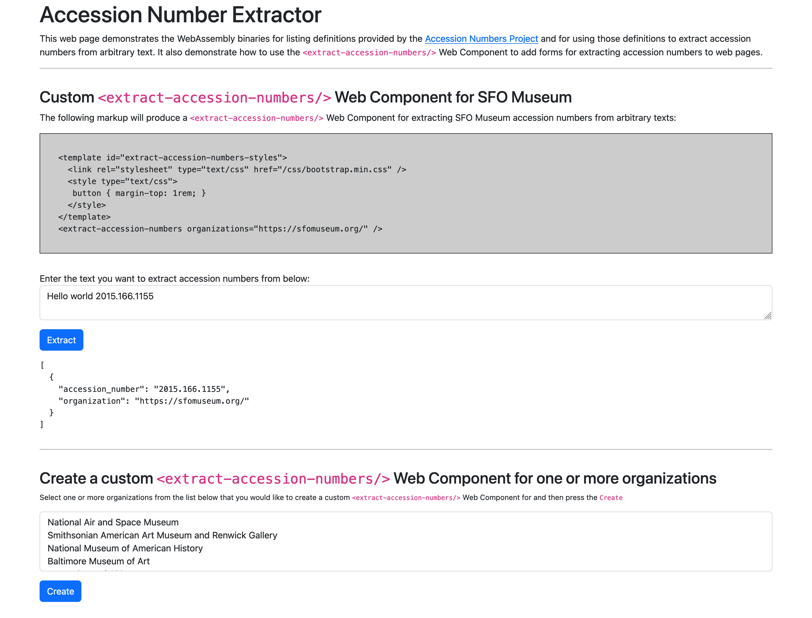

# go-acccession-numbers-wasm

WebAssembly binaries and Web Component elements for extracting accession numbers from text using the [sfomuseum/go-accession-numbers](https://github.com/sfomuseum/go-accession-numbers) package.

## Background

If you're not sure what this is all about have a look at the [sfomuseum/accession-numbers](https://github.com/sfomuseum/accession-numbers) repository and the [The Accession Numbers Project](https://millsfield.sfomuseum.org/blog/2021/12/30/accession-numbers/) blog post.

## Example

### WASM (JavaScript)

```
$> make wasm
GOOS=js GOARCH=wasm go build -mod vendor -ldflags="-s -w" -o www/wasm/extract.wasm cmd/extract/main.go
GOOS=js GOARCH=wasm go build -mod vendor -ldflags="-s -w" -o www/wasm/definitions.wasm cmd/definitions/main.go
```

And then load those binaries in your code. [For example](www/javascript/accessionnumbers.js):

```
accessionumbers = (function(){

    // JSON-encoded list of accession number definitions as specified by:
    // https://github.com/sfomuseum/go-accession-numbers/blob/main/definition.go#L10
    var definitions = null;
    
    var self = {

	init: function(){

	    return new Promise((resolve, reject) => {
	    
		// fetch definitions.wasm and export 'accession_numbers_definitions' function
		sfomuseum.wasm.fetch("/wasm/definitions.wasm").then(rsp => {
		
		    // fetch extract.wasm and export 'accession_numbers_extract' function
		    sfomuseum.wasm.fetch("/wasm/extract.wasm").then(rsp => {
		    
			// load and cache definitions
			accession_numbers_definitions().then(rsp => {
			    definitions = rsp;
			    resolve();
			});
		    });
		    
		}).catch(err => {
		    reject(err);
		});
	    });
	},

	extract: function(text){

            // Definitions are cached, extract text		 
	    if (definitions){

		return new Promise((resolve, reject) => {
	
		    accession_numbers_extract(text, definitions).then(rsp => {
			resolve(JSON.parse(rsp));
		    });
		    
		});
	    }

	    // Initialize WASM binaries and definitions cache, then extract text
	    return new Promise((resolve, reject) => {
		
		self.init().then(rsp => {
		    
		    accession_numbers_extract(text, definitions).then(rsp => {
			resolve(JSON.parse(rsp));
		    });
		    
		}).catch(err => {
		    reject(err)
		});
	    });
	},
    };

    return self;
    
})();
```

To use it you would do something like this:

```
accessionnumbers.extract("Text with accession number 2015.166.1155").then(rsp => {
	console.log(rsp);
});
```

### WASI (p1)

```
$> make wasip
GOARCH=wasm GOOS=wasip1 go build -mod vendor -ldflags="-s -w" -o www/wasip/extract.wasm ./cmd/extract-wasi/main.go
GOARCH=wasm GOOS=wasip1 go build -mod vendor -ldflags="-s -w" -o www/wasip/definitions.wasm ./cmd/definitions-wasi/main.go
```

_Note: As of this writing the `www/wasip/extract.wasm` binary has a different interface than that of the JavaScript `extract.wasm` binary. Specifically, the former loads and uses all the possible accession number definitions by default and it is not possible (yet) to pass a custom list of definitions to use._

For example:

```
$> wasmtime www/wasip/extract.wasm 'Hello world 2015.166.1155' | jq
[
  {
    "accession_number": "2015.166.1155",
    "organization": "https://americanart.si.edu/"
  },
  {
    "accession_number": "2015.166.1155",
    "organization": "https://americanhistory.si.edu/"
  },
  {
    "accession_number": "2015.166.1155",
    "organization": "https://artbma.org"
  },
  {
    "accession_number": "2015.166.1155",
    "organization": "https://www.artic.edu"
  },
  {
    "accession_number": "2015.166.1155",
    "organization": "https://new.artsmia.org"
  },
  {
    "accession_number": "world 2015",
    "organization": "https://www.britishmuseum.org"
  },
  {
    "accession_number": "2015.166.1155",
    "organization": "https://chrysler.org"
  },
  {
    "accession_number": "2015.166.",
    "organization": "https://www.clevelandart.org"
  },
  ... and so on
```

Or:

```
$> wasmtime www/wasip/definitions.wasm | jq .[].organization_name
"National Air and Space Museum"
"Smithsonian American Art Museum and Renwick Gallery"
"National Museum of American History"
"Baltimore Museum of Art"
"Art Institute of Chicago"
"Minneapolis Art Museum"
"British Museum"
"National Museum of China"
"Chrysler Museum of Art"
"Cleveland Museum of Art"
"Cooper Hewitt Smithsonian National Design Museum"
"Dallas Museum of Art"
"Denver Museum of Nature & Science"
"Getty Center"
"Ingenium"
"21st Century Museum of Contemporary Art, Kanazawa"
"Musée du Louvre"
"Milwaukee Art Museum"
"Musée National d'Art Moderne (Centre Pompidou)"
"Metropolitan Museum of Art"
"Museum of Fine Arts Boston"
"Museum of Modern Art"
"Musée d'Orsay"
"Vatican Museums"
"Museo del Prado"
"Museo Reina Sofía"
"National Museum of Anthropology"
"National Museum of Korea"
"National Gallery"
"National Gallery Singapore"
"Smithsonian National Museum of Natural History"
"National Gallery of Art"
"National Museum of African American History and Culture"
"Georgia O'Keeffe Museum"
"Rijksmuseum"
"State Russian Museum"
"Seattle Art Museum"
"San Francisco Museum of Modern Art"
"SFO Museum"
"Saint Louis Art Museum"
"National Gallery of Denmark"
"Tate Modern"
"Museum of New Zealand Te Papa Tongarewa"
"The Broad Museum"
"Victoria and Albert Museum"
"Virginia Museum of Fine Arts"
"Walker Art Center"
"Whitney Museum of American Art"
```

### Web Components

This package also provides a `extract-accession-numbers` Web Component that creates an HTML `form` element for entering custom text and then uses the WASM binaries to extract accession numbers. For example, the following markup will create a form element and a register code that will parse text and look for [accession numbers matching the definition defined by SFO Museum](https://github.com/sfomuseum/accession-numbers/blob/main/data/sfomuseum.org.json). 

```
<extract-accession-numbers data-organizations="https://sfomuseum.org/" />
```

Because you will almost certainly want to assign custom styles to the Web Component let me save you the trouble and show you how that's done [using an HTML `template` element](https://developer.mozilla.org/en-US/docs/Web/API/Web_components/Using_templates_and_slots):

```
<template id="extract-accession-numbers-styles">
  <link rel="stylesheet" type="text/css" href="/css/bootstrap.min.css" />
  <style type="text/css">
   button { margin-top: 1rem; }
  </style>
</template>
<extract-accession-numbers organizations="https://sfomuseum.org/" />
```

The `extract-accession-numbers` Web Component accepts the following attributes:

| Name | Value | Notes |
| --- | --- | --- |
| organizations | A space-delimited list of URIs of the organizations whose accession numbers should be extracted from a text | The URLs should match of the value of the `organization_url` property in the definitions published in [sfomuseum/accession-numbers](https://github.com/sfomuseum/accession-numbers) repository. If not present then all the organization definitions returned by the `accession_numbers_definition` WASM binary will be used. |
| label | A custom label to appear over the `textarea` element where text to be parsed is entered | The default value is "Enter the text you want to extract accession numbers from below:" |
| post-messages | | This attribute has no specific value. If present a data structure containing the text that was parsed and any matches will be broadcast out to the parent window using the [window.postMessage](https://developer.mozilla.org/en-US/docs/Web/API/Window/postMessage) API. This is a bit of an end-run around the security model for Web Components and the ShadowDOM so you should only use this if you know what you are doing. It is up to you to implement custom code to capture and process those messages. |

For a complete example of how to use the `extract-accession-numbers` Web Component run the `cmd/server/main.go` program:

```
$> go run cmd/server/main.go
2024/01/05 14:01:30 Listening on http://localhost:8080
```

And the open `http://localhost:8080` in your web browser. You should see a web page like this:



## See also

* https://github.com/sfomuseum/accession-numbers
* https://github.com/sfomuseum/go-accession-numbers
* https://millsfield.sfomuseum.org/blog/2021/12/30/accession-numbers/